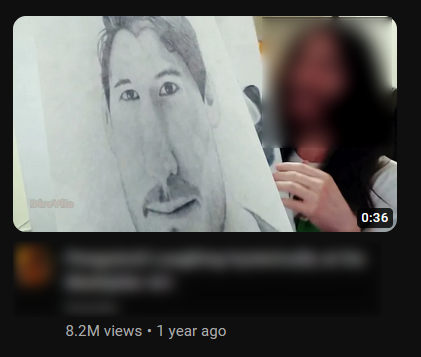
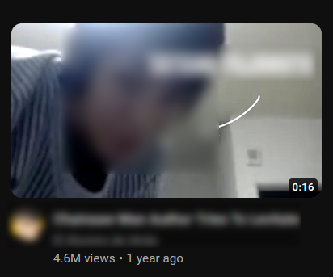

# YouTube: Remove Videos Based on Duration

This Tampermonkey script is designed to customize your YouTube recommendations by removing videos that are either too short or too long. It operates by scanning the videos in your YouTube recommendations and removing any that do not fall within the specified duration range.

Videos like this can be removed:

<p float="left">
  
  
</p>

## How does it work?

The script works by scanning the videos in your YouTube recommendations and removing any that are shorter than a specified minimum duration or longer than a specified maximum duration. By default, these durations are set to remove videos shorter than 1 minute and longer than 1 hour(by default max duration is disabled), but these can be easily adjusted to suit your preferences.

## Installation 

1. Install tampermonkey extension:

<a href="https://chrome.google.com/webstore/detail/tampermonkey/dhdgffkkebhmkfjojejmpbldmpobfkfo?hl=en">Chromium</a>

<a href="https://addons.mozilla.org/ru/firefox/addon/tampermonkey/">Firefox</a>

2. Install this script:

<a href="https://greasyfork.org/ru/scripts/478560-youtube-remove-videos-based-on-duration">Greasy fork</a>

That's it! Now you can use it.

## Customizing the Duration Thresholds

To adjust the duration thresholds, you need to modify the values of `minDuration` and/or `maxDuration` in the script. For instance, if you want to remove videos shorter than 2 minutes and longer than 20 minutes, you would change:

```javascript
var minDuration = "1:00"; // Minimum duration
var maxDuration = "10:00"; // Maximum duration
```

to: 

```javascript
var minDuration = "2:00"; // Minimum duration
var maxDuration = "20:00"; // Maximum duration
```

If you only want to remove videos that are shorter than a certain duration, you can comment out the maxDuration line. Similarly, if you only want to remove videos that are longer than a certain duration, you can comment out the minDuration line.

## License
This project is licensed under the terms of the MIT license.
